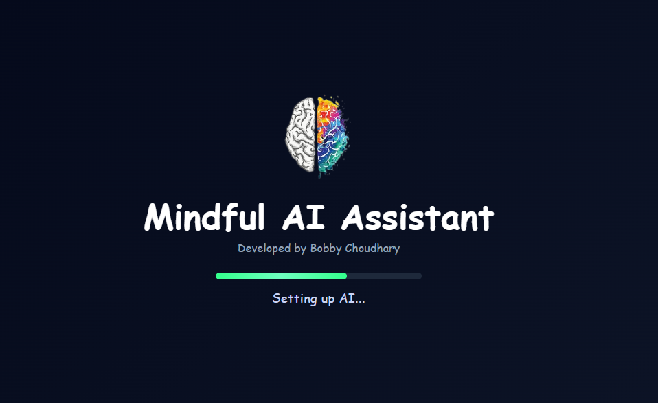
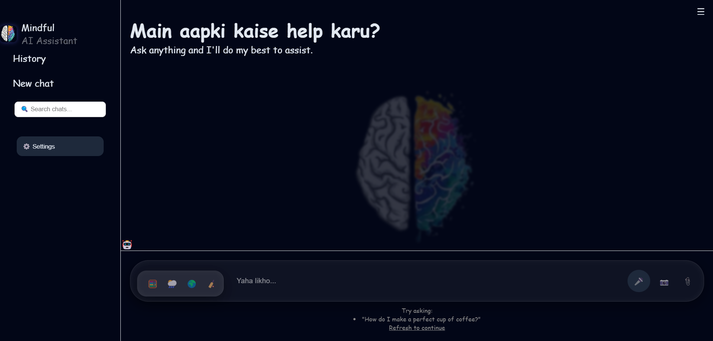

# Mindfull-Ai-assistant
🤖 Smart AI assistant with chat interface, voice input, file upload, and multi-language support. Features weather, translation, and command-based tools with modern UI, animations, and responsive design.
<!-- ===== ANIMATED GRADIENT HEADER ===== -->
<h1 align="center">
  
</h1>

<!-- ===== LOGO + TITLE ===== -->
<p align="center">
  
</p>

<h3 align="center">🤖 Smart AI Assistant Web Application</h3>

<p align="center">
  
</p>

---

<!-- ===== BADGES ===== -->
<p align="center">
  
  
  
</p>

---

## 🎥 Live Preview  

<p align="center">
  
</p>

---

## 🌐 Live Demo  

<p align="center">
  <a href="https://your-live-link.com">
    
  </a>
</p>

---

## 🖼️ Screenshots  

<p align="center">
  
  
</p>

---

## 🚀 Features  

✨ Real-time AI chat interface  
🎤 Voice input (Speech Recognition)  
📂 File upload & drag-drop support  
🌍 Multi-language support  
🎨 Theme customization (Light / Dark / Neon)  
🧠 Smart response system  
🌦️ Weather API integration  
🌐 Translator feature  
🏏 Sports updates  
💾 Chat history (Local Storage)  
📱 Fully responsive design  

---

## 🛠️ Tech Stack  

<p align="center">


</p>

---

## ⚡ Quick Commands  

```bash
/calc 2+2
/weather
/translate hello
/sports

```bash
📦 ai-assistant-dashboard
 ┣ 📂 images
 ┣ 📜 index.html
 ┣ 📜 style.css
 ┣ 📜 script.js
